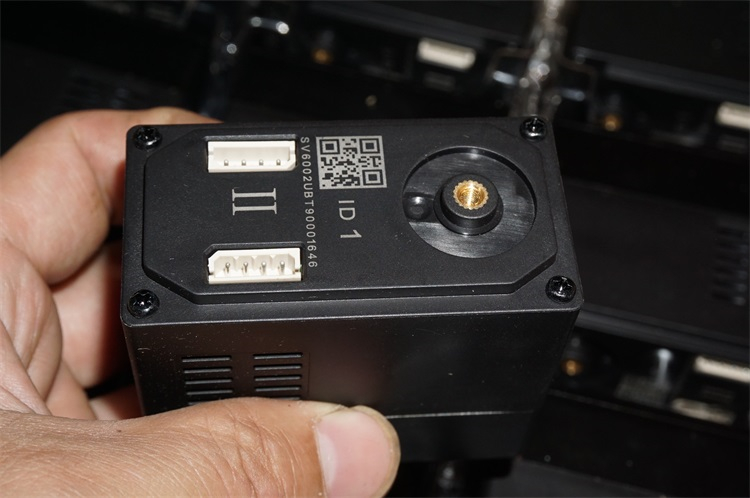

# UBTECH 서보 프로토콜 분석 및 문서화 프로젝트 개요

UBTECH(优必选)사의 로봇 서보 프로토콜을 분석하고, 정리하여 제어하는 방법을 문서화한 프로젝트입니다. 
ubtech 서보는 타오바오, 알리익스프레스 등에서 중고 제품이 저렴하게 판매된 적 있이 있습니다
다만 현재는 시중 재고가 거의 없으며, 공식적으로는 더 이상 판매되지 않는 것으로 보입니다.

## ubtech 서보 모델
- 대형 로봇용 서보 : 60kg CAN 서보
- 중형 로봇용 서보 : 25kg 서보
- 소형 로봇용 서보 

## 1. 대형 서보

### 하드웨어 스펙

## 하드웨어 사양

### 기본 사양
| 항목 | 사양 |
|------|------|
| 크기 (길이×너비×높이) | 63mm × 34mm × 63.9mm |
| 정격 전압 | 24V |
| 입력 전압 | 18V ~ 35V |
| 최대 토크 | 60 kg·cm @ 24V |
| 최대 속도 | 0.148초/60° @ 무부하 24V |
| 각도 범위 | 0° ~ 360° |
| 무부하 고정(락) 위치 정밀도 | 0.3° |
| 최대 동작 전류 | 3A |
| 모터 타입 | 영구자석 동기모터 (PMSM) |
| 동작 온도 | -10℃ ~ 45℃ |
| 보관 온도 | -40℃ ~ 60℃ |
| 통신 방식 | CAN 버스 (1M) |
| ID 범위 | 1 ~ 254 |
| 무게 | 220g |
| 재질 | 금속 기어, 플라스틱 하우징 |

 

### 핀 배치 (4핀 5264 커넥터)
| 핀 번호 | 신호명 | 설명 |
|---------|--------|------|
| 1 | V+ | 전원 (+24V) |
| 2 | GND | 접지 |
| 3 | CANH | CAN High |
| 4 | CANL | CAN Low |

### 프로토콜
Protocol_CAN_Bus.md 참조

## 2. 중형 서보
### 하드웨어 스펙
### 프로토콜
Protocol_Serial.md 참조

## 3.소형 서보
### 하드웨어 스펙
### 프로토콜
Protocol_Serial.md 참조

--------------------------------------------------------------------
---

### 2. Serial 프로토콜 (FA AF / FC CF)
**적용 대상**: 중소형 서보 (A, B, C Type)
- **문서**: [Protocol_Serial.md](Documents/Protocol_Serial.md)
- **프레임 헤더**: `FA AF` (일반) / `FC CF` (펌웨어)
- **통신 방식**: UART Serial
- **보드 레이트**: 115200 bps
- **특징**:
  - Big-Endian 바이트 순서
  - 각도 범위: 0-240도
  - 오프셋 보정 지원

---

### 3. 제어보드 프로토콜 (A9 9A)
**적용 대상**: UBTECH 로봇 통합 제어보드
- **문서**: [Protocol_Control_Board.md](Documents/Protocol_Control_Board.md)
- **프레임 헤더**: `A9 9A`
- **프레임 종료**: `ED`
- **통신 방식**: UART Serial
- **보드 레이트**: 115200 bps
- **특징**:
  - 다중 서보 동시 제어
  - MP3 재생 통합
  - LED 제어
  - 동작 그룹 관리

---

**개발자**: pashiran  
**문서 버전**: 1.0  
**마지막 업데이트**: 2025-11-05

